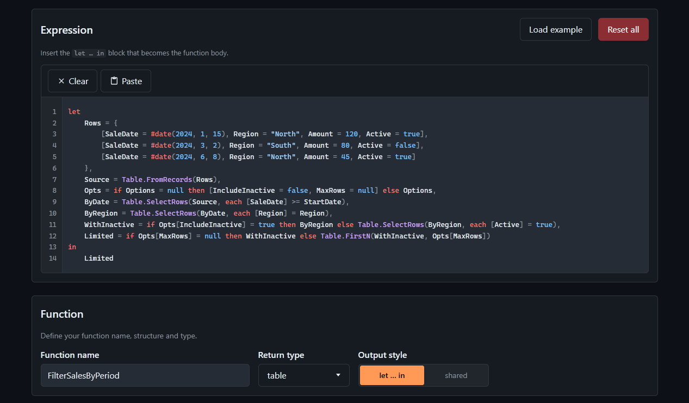

#  Power Query M Function Creator

Wrap a Power Query `let … in` block in a typed, documented M function with ease. Alternatively, import an existing function to edit.

Site: [filcuk.github.io/pqm-function-creator](https://filcuk.github.io/pqm-function-creator/)

## License

MIT — see [LICENSE](LICENSE).
